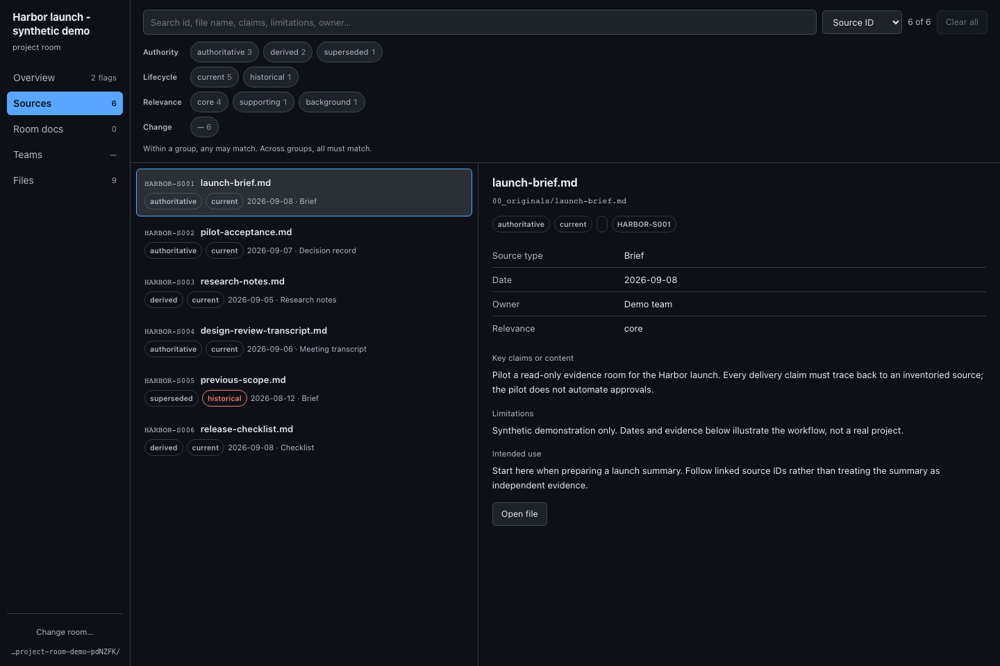

# project-room-browser

A **canvas extension** for GitHub Copilot CLI that browses a
[`project-room`](../../skills/project-room/) folder: source inventory, review
signals, room docs, files, and Teams conversation coverage.

> **This is not a skill.** Skills in [`skills/`](../../skills/) are portable
> markdown you copy into any agent. This is JavaScript that runs a local
> HTTP server and renders a UI, so it only works in Copilot CLI and needs
> Node. It is kept here so it stays in step with the skill it reads — the two
> encode the same rules, and when the skill's rules change this must follow.

## Install

```bash
cp -R extensions/project-room-browser ~/.copilot/extensions/project-room-browser
```

Then open it from an agent session, optionally with a room path:

```
open the project-room canvas for ~/project-rooms/<room>
```

## What it shows

| Page | Answers |
|---|---|
| **Overview** | Is this a valid room? What drift is there — inbox backlog, expired renders, inventory rows pointing at missing files, sources not safe to cite as current? |
| **Sources** | The inventory, faceted by Authority and Lifecycle, with full-text search. |
| **Room docs** | README, change log, conflict log, duplicate log, missing context. |
| **Teams** | One card per *conversation*: cadence-aware coverage age, partial captures, missing artifacts, known gaps, and index reconciliation needs. Only actual capture gaps enter the sweep plan; disputed identities and incomplete index records stay visible without inventing missing captures. |
| **Files** | Every file in the room, with bounded text and image previews. |

Conversation age uses effective current captures, while historical captures stay
visible. Unregistered captures remain reconciliation work regardless of age.
Ambiguous matches never verify coverage; only a valid, non-future date from a
uniquely attributed current inventory capture can dispute the index's age.
Source chips select the complete Source ID, not a substring match.
Overview badges and cards use the same warning model. The coverage reader and
Markdown preview share table-cell parsing so escaped pipes cannot shift columns.
Artifacts without a conversation match remain visible in a separate unattributed
collection, with an Index action for reconciliation rather than automatic
re-capture. Duplicate conversation identities and quick-map targets are rejected
before actions appear. Missing occurrence artifacts stay actionable unless the
record rules out retrieval or the occurrence is still in the future.
Conversation identity comes from declared `chat_id` metadata, not incidental
references in notes.
ASCII `...` and Unicode ellipses follow the same abbreviation rules, without
promoting an abbreviated value to a full chat ID.

## Screenshot

The running standalone canvas with synthetic demo data:



## Theming

The panel has no palette and no theme picker. It aliases the host's canvas
theme variables (`--background-color-default`, `--text-color-default`,
`--true-color-*`, `--font-sans`, `--font-mono`) into a raw layer, then derives
its semantic tokens (`--color-*`, `--severity-*`) from those. Application
selectors use the semantic layer; the raw fallback palette contains colour
literals for hosts that omit theme tokens.

Because every token is a live `var()` reference, **the panel follows the app's
theme automatically** — change the theme in GitHub and the whole surface
re-cascades with no JavaScript, no reload, and no loss of scroll position or
selection.

## Read-only, by design

The canvas never writes to the room and holds no external-service credentials. Its action
buttons (Ingest inbox, Refresh room, Sweep, Re-capture, Save a nugget, Make a
task, Reconcile index) **generate an instruction for you to read and run** —
Index, Refresh and reconciliation name the relevant `project-room` operation
file, so the skill owns those maintenance procedures.
Sweep registration and reconciliation also route through Index, including its
maintenance snapshot and human review gate.
Make a task records follow-up work and completion criteria, rather than asking
the agent to perform that maintenance immediately.

Room content is treated as untrusted data throughout: it is HTML-escaped in the
UI, and dynamic context stays inside labelled data blocks in every generated
prompt. Values are quoted and bounded; sweep plans carry escaped JSON.
Inspect generated instructions before running them with an authenticated agent.
Prompt paths preserve their exact spelling, including whitespace, within a
32,768-character budget; larger paths are explicitly omitted, not shortened into
a different target. Bounded inbox listings report both the total and omitted
path counts.
Agent source searches return the full matched count alongside the limited rows.
Room selection also preserves the entered path's whitespace. File previews keep
their Back control during loading and errors, returning keyboard focus to the
file tree without accepting a late response.
View updates preserve logical keyboard focus and text selection, or move to a
visible destination control. Date sorting uses the same calendar validation as
coverage; unusable dates stay last in both directions.

## Local access

Each server creates a private launch URL with two random capabilities in its
fragment. The public HTML contains neither capability nor the selected room
path. Keep the complete launch link private: the full capability authorizes
room selection and file reads through the API header.

Image URLs use a separate image-only capability. It cannot authorize room,
folder, or text-file access, and query tokens never authorize the main API.
Cross-site requests are refused even with a capability. This is an HTTP
access boundary, not isolation from processes that can inspect the CLI's
memory or private launch-link records.

Manifest-selected files must remain inside the room, including through
symlinks. Metadata files are limited to 2 MiB each and rejected rather than
partially parsed. Text previews show up to 2 MiB, and raw image previews are
limited to 25 MiB; larger images are listed as non-previewable files rather than
broken image previews. Source paths use consistent separators, and unrecognised
source layouts are reported as unverified rather than clean.

## Testing

From the repository root, install development dependencies and run the
filesystem/parser, real HTTP, SDK-action, and browser regressions:

```bash
npm ci
npm run test:canvas
npm run test:canvas:browser
```

The tests use Node's built-in runner (Node 22.15 or newer) and Playwright with
synthetic rooms. If Chromium is not installed, run
`npx playwright install chromium` before the browser suite. These dependencies
are development-only; copying this extension does not require an npm install.

`serve.mjs` runs the same request handler as the real extension (both delegate
to `routes.mjs`). From this extension's directory:

```bash
node serve.mjs 7900 /path/to/room   # a specific room
node serve.mjs 7900 -               # no room, exercises the picker
PROJECT_ROOM=/path/to/room node serve.mjs 7900
```

Open the complete private URL printed by the launcher, including its fragment.
Opening only the loopback origin does not authorize access to a room.
